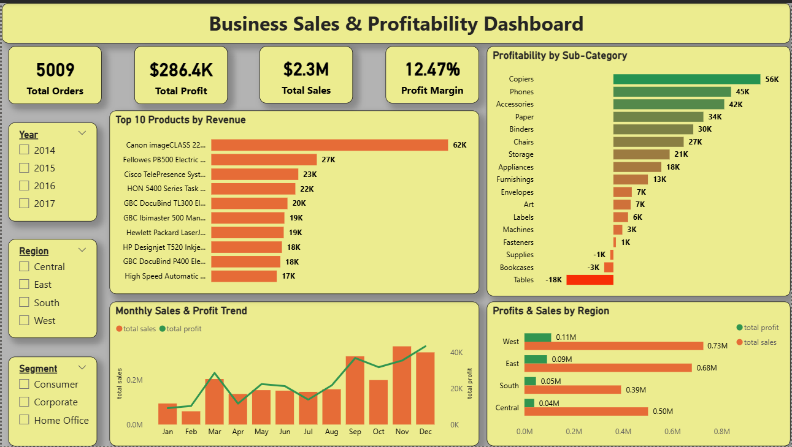

# Superstore Retail Sales & Profitability Analytics Dashboard

## 📌 Project Overview
An end-to-end Data Analytics & Business Intelligence project analyzing multi-year retail transactional data across 5,000+ distinct orders, generating **$2.30M in sales** and **$286.4K in profit**[cite: 3].

The objective was to identify revenue trends, high-performing products, category and regional profitability patterns, and key opportunities to improve overall profit margins through data-driven business recommendations[cite: 3].

---

## 🛠️ Tech Stack & Methodology
- **Data Cleaning & Preparation:** Microsoft Excel (reconciliation, data formatting, initial validation)
- **BI & Visualization:** Microsoft Power BI Desktop
- **ETL Transformation:** Power Query (type casting, schema validation)
- **Data Modeling:** Star Schema with a dedicated dynamic `Calendar` dimension[cite: 3]
- **Analytics & Calculations:** DAX (Data Analysis Expressions)[cite: 3]
- **Dataset:** Superstore retail transactional data[cite: 3]
- **Key Techniques:** Spreadsheet data cleaning, star-schema data modeling, KPI development, time-series analysis, profitability analysis, interactive filtering

---

## 📊 Dashboard Preview


### Dashboard Components
- **Executive KPI Scorecard:** `Total Orders: 5,009`, `Total Sales: $2.30M`, `Total Profit: $286.4K`, `Net Profit Margin: 12.47%`[cite: 3]
- **Top 10 Products by Revenue:** Identifies the highest revenue-generating products[cite: 3].
- **Monthly Sales & Profit Trend:** Highlights seasonality, revenue patterns, and profitability trends[cite: 3].
- **Profitability by Sub-Category:** Identifies major profit drivers and loss-making sub-categories[cite: 3].
- **Sales & Profit by Region:** Compares geographic revenue performance and profit conversion[cite: 3].
- **Interactive Slicers:** Year, Region, and Segment

---

## 📐 Key DAX Measures

```dax
-- Dedicated Calendar Dimension Table
Calendar =
ADDCOLUMNS (
    CALENDAR (
        MIN ( 'Sample - Superstore'[Order Date] ),
        MAX ( 'Sample - Superstore'[Order Date] )
    ),
    "Year", YEAR ( [Date] ),
    "Month", FORMAT ( [Date], "mmm" ),
    "Month Number", MONTH ( [Date] ),
    "Year-Month", FORMAT ( [Date], "yyyy-mm" ),
    "Quarter", "Q" & FORMAT ( [Date], "q" )
)

-- Core Business Measures
Total Sales =
SUM ( 'Sample - Superstore'[Sales] )

Total Profit =
SUM ( 'Sample - Superstore'[Profit] )

Profit Margin =
DIVIDE ( [Total Profit], [Total Sales], 0 )

Total Orders =
DISTINCTCOUNT ( 'Sample - Superstore'[Order ID] )
```

---

## 🔍 Key Analytical Findings

### 1. Revenue Trends & Seasonality
* **Q4 Sales Surge:** Sales consistently increase from September through December, with November ($352K) and December ($325K) recording the highest monthly sales[cite: 3].
* **Q1 Contraction:** January ($94K) and February ($59K) represent significant seasonal troughs compared with Q4[cite: 3].
* **March Procurement Spike:** March consistently shows a strong increase, reaching approximately $205K in sales and $30K in profit[cite: 3].

### 2. Top-Selling & High-Value Products
* **Top Revenue Product:** *Canon imageCLASS 2200 Advanced Copier* — $61.6K revenue[cite: 3].
* **Fellowes PB500 Electric Punch Binding Machine:** Approximately $27.5K revenue[cite: 3].
* **Cisco TelePresence System EX90:** Approximately $22.6K revenue[cite: 3].

*These products represent important contributors to overall revenue and should be evaluated for inventory availability and targeted enterprise sales.*

### 3. Category & Regional Diagnostics
* **Profit Drivers:**
  * Technology — 17.39% margin[cite: 3]
  * Office Supplies — 17.03% margin[cite: 3]
  * Copiers — 37.20% margin[cite: 3]
  * Paper — 43.39% margin[cite: 3]
* **Profit Leaks:**
  * Furniture has significantly lower profitability at approximately 2.49% margin, primarily driven by losses in:
    * Tables — -$17.7K[cite: 3]
    * Bookcases — -$3.5K[cite: 3]
* **Regional Performance:**
  * West — 14.94% margin[cite: 3]
  * East — 13.48% margin[cite: 3]
  * Central — 7.92% margin[cite: 3]
  * *The Central region shows a significant profitability gap compared with leading regions[cite: 3].*

---

## 💡 Strategic Business Recommendations

1. **Control Furniture Discounting:** Introduce stricter discount thresholds for Furniture products, particularly Tables and Bookcases, to reduce negative-margin transactions and improve category profitability[cite: 3].
2. **Bundle High-Margin Products:** Create corporate bundles combining high-margin Copiers with recurring office consumables such as Paper, encouraging larger and longer-term customer contracts[cite: 3].
3. **Optimize Regional Sales Incentives:** Shift sales incentives from revenue-based targets toward profit-margin-based KPIs, particularly in lower-margin regions such as Central[cite: 3].
4. **Address Q1 Seasonality:** Introduce early renewal campaigns and scheduled Q1 replenishment programs during late Q4 to reduce seasonal revenue volatility[cite: 3].

---

## 📈 Business Impact
The analysis demonstrates how raw transactional data can be cleaned and structured to drive business intelligence by:
* Cleaning, reconciling, and structuring transactional records in Excel
* Identifying revenue and profit trends[cite: 3]
* Detecting loss-making product categories[cite: 3]
* Comparing regional profitability[cite: 3]
* Highlighting high-value products[cite: 3]
* Supporting pricing and discount decisions[cite: 3]
* Providing executives with an interactive KPI dashboard[cite: 3]

---

## 🎯 Skills Demonstrated
`Microsoft Excel` • `Power BI` • `DAX` • `Power Query` • `Data Cleaning` • `Data Modeling` • `KPI Development` • `Business Intelligence` • `Data Visualization` • `Profitability Analysis` • `Time-Series Analysis` • `Business Recommendations`

---

## 📁 Repository Structure
```
├── Business_Sales_Profitability_Report.pdf
├── Dashboard_overview.png
├── Sample - Superstore.csv
├── Super Store sales.pbix
└── README.md
```

---

## 👤 Author & Acknowledgments
* **Author:** Katti Pramod Herald
* **Role:** Data Science & Analytics Intern
* **Internship Program:** Future Interns
* **LinkedIn:** [linkedin.com/in/k-pramod-herald-92a27b295](https://www.linkedin.com/in/k-pramod-herald-92a27b295)
* **GitHub:** [github.com/Kp-herald](https://github.com/Kp-herald)

*Special thanks to the Future Interns team for providing the guidance and dataset for this analytical evaluation.*
